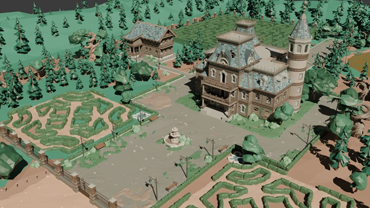
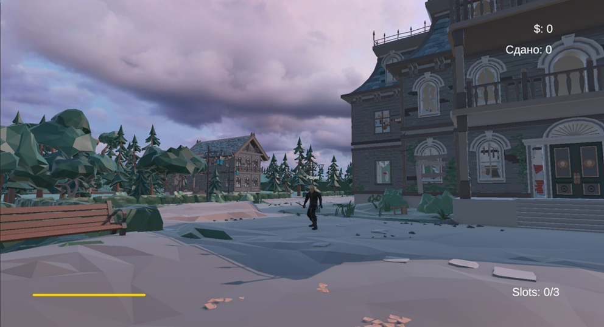

# Theft of Artefact


**«Theft of Artefact»** — это сессионный командный PvP-экшен, построенный на скрытности, позиционировании и нелетальном физическом взаимодействии. В игре полностью отсутствует огнестрельное оружие: ключевыми механиками становятся оглушение, задержание и командная взаимовыручка.





---

## Основные особенности и механики

- **Асимметричный геймплей (4 vs 4):**
  - **Воры (Thieves):** Ориентированы на скрытность и мобильность. Проникают в особняк, собирают ценности и искомый артефакт, избегают патрулей и спасают схваченных напарников.
  - **Охрана (Guards):** Выполняют функции контроля территории и наблюдения. Патрулируют коридоры, оглушают нарушителей дубинками и выдерживают их в камере заключения.
- **Цикл нелетального боя «Оглушение — Задержание»:**
  - Охранник наносит удар дубинкой, истощая стамину вора и переводя его в состояние оглушения.
  - Оглушенного игрока можно заковать в наручники и переместить в камеру заключения.
  - Напарники вора могут проникнуть в блок охраны и освободить задерживаемого участника.
- **Динамическая задача сессии:**
  - На карте размещено 5 уникальных артефактов, но целевым является только один (информация доступна ворам).
  - Ворам нужно не только украсть целевой артефакт, но и набрать лимит общей стоимости за счет обычных ценностей (ограничение инвентаря: до 3 предметов за раз).
- **Сетевая архитектура с серверной авторитетностью:**
  - Защита от десинхронизации и читерства: все критические действия (удары, подбор лута, статус ареста) валидируются на сервере/хосте.
  - Поддержка до 8 игроков в одной сессии по модели Client-Hosted.
- **Тактический дизайн карты:**
  - Трехуровневая локация: главный особняк, садовый лабиринт для разрыва дистанции и дом охраны.

---

## Архитектура и Сетевая логика

Архитектура строится на сочетании шаблонов клиент-серверного взаимодействия Mirror:

- **`GameNetworkManager`** — управление подключениями, сменой сцен и спавном персонажей.
- **`PlayerLobbyData`** — временный сетевой объект хранения имени и команды в лобби (`SyncVar`).
- **`PlayerController` & `PlayerCombat`** — обработка ввода (`isLocalPlayer`), вычисление атак через `SphereCast` и отправка команд на сервер (`[Command]`).
- **`PlayerAudioManager` & `PlayerAnimations`** — рассылка звуковых эффектов и анимаций всем клиентам через `[ClientRpc]`.
- **Синхронизация трансформаций:** `NetworkTransformUnreliable` для координат/поворотов и `NetworkAnimator` для состояний персонажей.

---

## Технологический стек

- **Игровой движок:** Unity 6.3 LTS
- **Язык программирования:** C#
- **Сетевой фреймворк:** Mirror 
- **Графический стиль:** Low Poly 3D
- **Среда разработки:** Visual Studio 2022
- **Система контроля версий:** Git / GitHub

---

## Запуск и установка

### Требования
- **Unity 6.3 LTS** или новее.
- **Visual Studio 2022** (с установленным модулем *Разработка игр на Unity*).
- ОС: **Windows 10 / 11** (64-bit).

### Запуск из исходного кода
1. **Клонирование репозитория:**
   ```bash
   git clone https://github.com/IlyaErmolovich/coursework_s6
   cd coursework_s6
   ```
   
2. Открытие проекта:
   - Запустите Unity Hub и добавьте папку проекта.
   - Перейдите в папку `Assets/Scenes/` и откройте сцену `MainMenu.unity`
   
3. Сборка и проверка сети:
   - В меню перейдите в `File -> Build Settings`.
   - Выберите платформу PC, Mac & Linux Standalone и нажмите Build.
   - Запустите один экземпляр приложения как Host, а второй — как Client.
   
